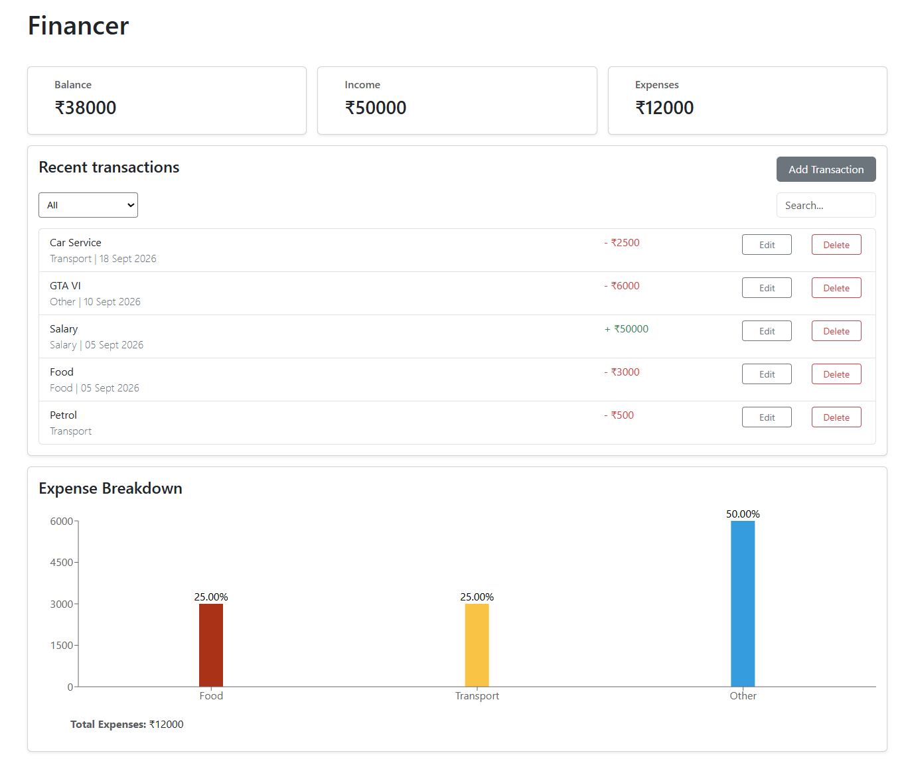
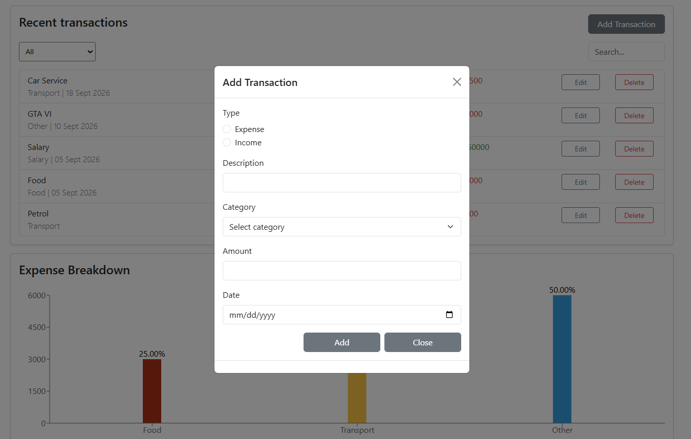
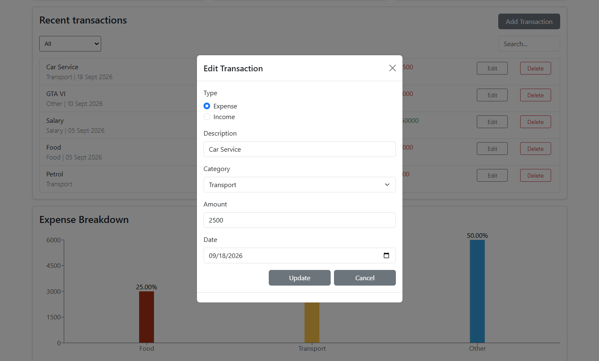
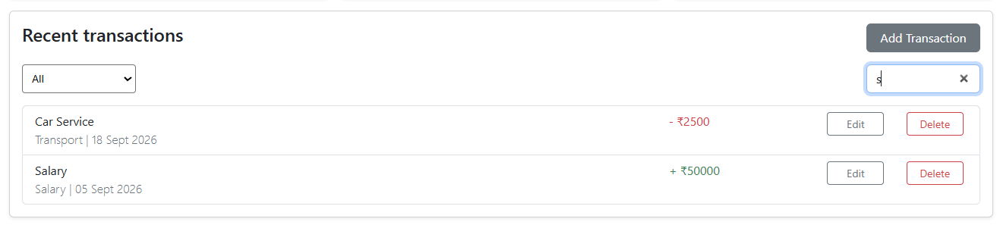
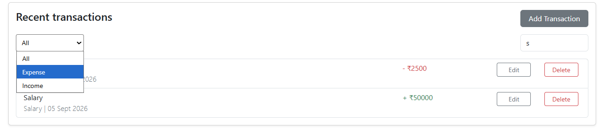

# Finance Manager

A responsive finance management web application built with React.js. The application allows users to record, manage, and analyze their income and expenses through a simple and interactive interface.

## Features

* **Summary Cards** — Displays total income, total expenses, and current balance.
* **Transaction Form** — Add new income and expense transactions.
* **Transaction List** — View all recorded transactions.
* **Edit Transactions** — Update existing transaction details.
* **Delete Transactions** — Remove transactions from the list.
* **Transaction Filtering** — Filter transactions based on their type or category.
* **Expense Breakdown** — Visualize expenses by category using a bar chart.
* **Responsive UI** — Designed to work across different screen sizes.

## Technologies Used

* React.js
* JavaScript
* HTML5
* CSS3
* Bootstrap
* Recharts

## Key React Concepts Practiced

* Functional components
* Props
* State management with `useState`
* Derived data
* Event handling
* Array methods such as `map()` and `reduce()`
* Immutable state updates
* Conditional rendering
* Form handling
* Component-based UI design
* Data visualization with Recharts

## CRUD Operations

The application supports the complete CRUD workflow for transactions:

* **Create** — Add a new transaction.
* **Read** — Display existing transactions.
* **Update** — Edit an existing transaction.
* **Delete** — Remove a transaction.

## Installation

1. Clone the repository:

```bash
git clone https://github.com/itz-ds/react-finance-manager.git
```

2. Navigate to the project directory:

```bash
cd finance-manager
```

3. Install the required dependencies:

```bash
npm install
```

## How to Run

Start the development server:

```bash
npm start
```

The application will be available at:

```text
http://localhost:3000
```

## Screenshots

### Dashboard



### Transaction Form

#### Add Transaction Form



#### Update Transaction Form



### Expense Breakdown



### Filter Transactions



## What I Learned

Through this project, I practiced building a React application from scratch and strengthened my understanding of state management and component communication.

I particularly practiced managing transaction data, implementing CRUD operations, handling forms, deriving summary information from state, and creating an expense breakdown using a bar chart.

## Future Improvements

* Add persistent data storage with a backend or database.
* Add user authentication.
* Add transaction dates and date-based filtering.
* Add monthly and yearly expense reports.
* Add additional charts for financial analysis.
* Deploy the application for public access.

## Author

**Dinesh**

GitHub: [itz-ds](https://github.com/itz-ds)
